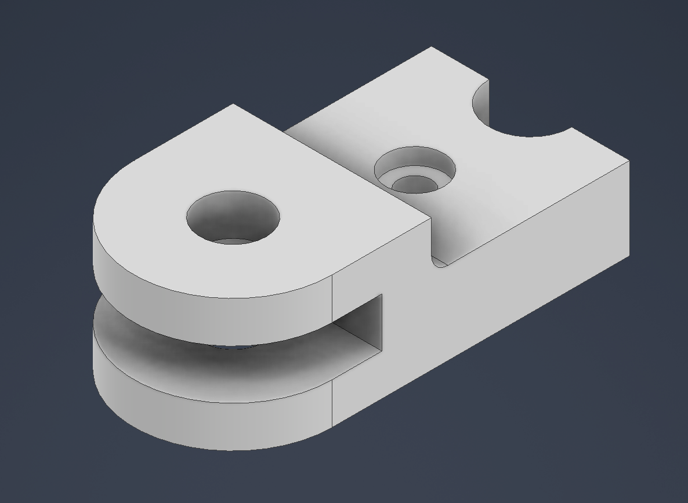
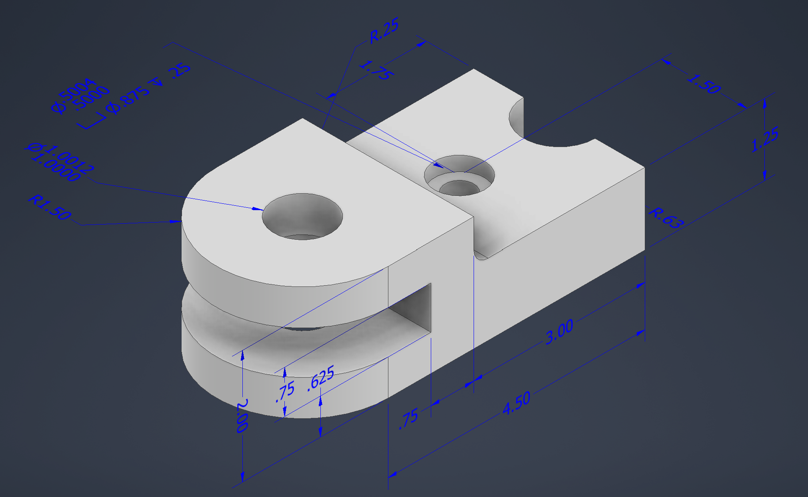

# Pivot Lock CAD Model

This project contains a 3D CAD model of a pivot lock component created in Autodesk Inventor.
The part demonstrates basic mechanical design features including holes, fillets, slots, and dimensional constraints.

## Model Preview

## Dimensioned Model

## Files Included

* `pivot_lock.ipt` – Autodesk Inventor part file
* `pivot_lock.png` – Clean rendered view of the model
* `pivot_lock_dimensions.png` – Dimensioned engineering view

## Skills Demonstrated

* Parametric 3D CAD modeling
* Mechanical part design
* Dimensioning and engineering visualization
* Autodesk Inventor workflow
