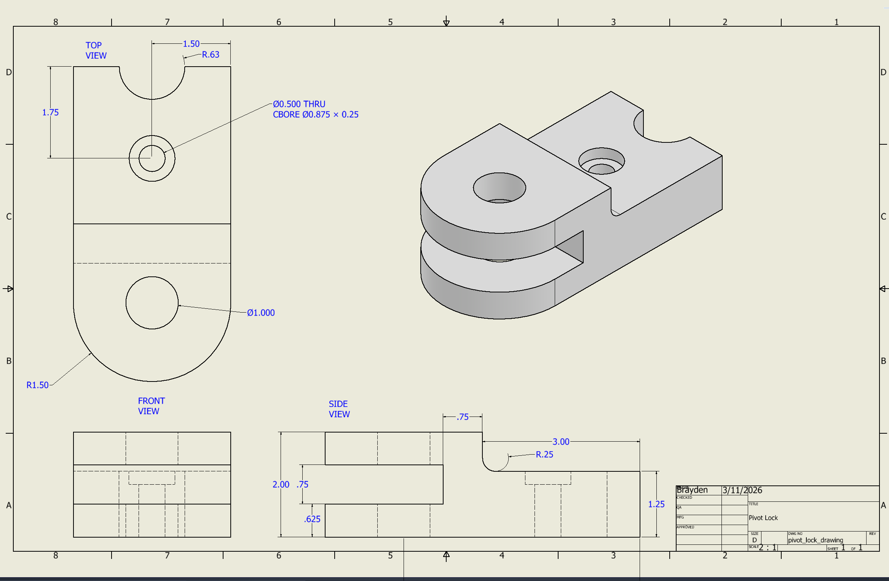

# Pivot Lock CAD Model

This project demonstrates the design and documentation of a mechanical pivot lock component created using Autodesk Inventor.

The part was modeled parametrically and documented with an engineering drawing including orthographic views, dimensions, and feature annotations.

---

## 3D Model Preview

---

## Engineering Drawing

---

## Files Included

- **pivot_lock.ipt** – Autodesk Inventor part file  
- **pivot_lock_drawing.pdf** – Engineering drawing of the part  
- **pivot_lock.png** – Rendered preview of the 3D model  
- **pivot_lock_drawing.png** – Preview image of the engineering drawing  

---

## Skills Demonstrated

- Parametric CAD modeling  
- Mechanical component design  
- Engineering drawing creation  
- Dimensioning and documentation  
- Autodesk Inventor workflow

---

## Software Used

- Autodesk Inventor Professional 2026
